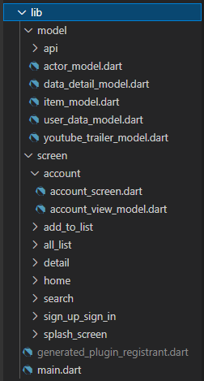
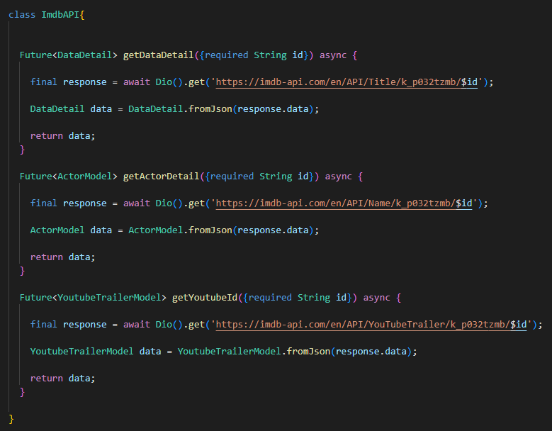
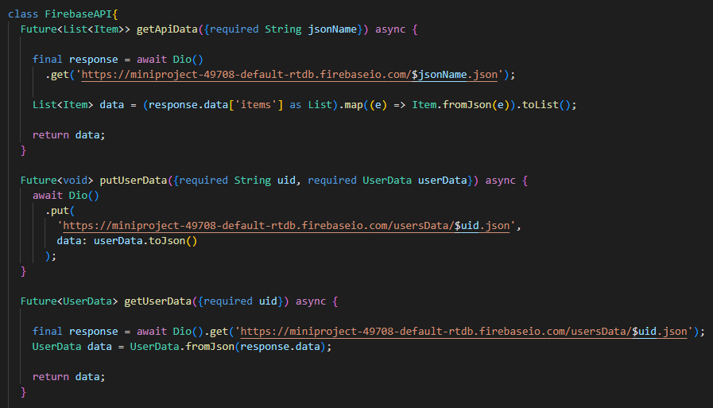
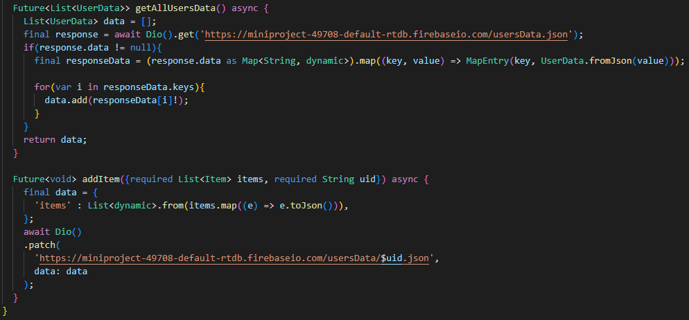

# Mini Project

A mini project that are made using IMDB api and sdk form firebase, so user could do sign up also sign in to save their movie or series list with certain status, for example, the user has a movie in the list with status of watching and more.

## Task

Tugas ini merupakan tugas kita sebagai siswa, untuk membuat sebuah aplikasi berdasarkan syarat-syarat tertentu yang berhubungan dengan dari apa yang sudah kita pelajari. Untuk syarat-syarat tersebut diantara lain.

- Minimum memiliki 5 halaman.
- Menerapkan MVVM architecture.
- Mengakses data menggunakan RESTful API atau SQLite.
- Menggunakan transition.
- Menggunakan Form.

Dari persyaratan diatas ini, saya membuat sebuah aplikasi dengan menggunakan api dari IMDB, dimana imdb disini merupakan sebuah database online yang berisikan informasi tentang film, acara telivisi, dan series.

## Minimum Memiliki 5 Halaman
Dari syarat nomor 1, saya sudah membuat sebanyak 5 halaman, yaitu homepage screen, search screen, account screen, listview screen, Sign in Screen, Sign up Screen dan juga detail screen. Berikut adalah kumpulan screenshot dari halaman yang sudah dibuat pada aplikasi.

- Splash Screen.

- Home Page Screen.

- ListView Screen.

- Detail Screen.

- Search Screen.

- Account Screen (Not Signed In)

- Account Screen (Signed In)

- Sign Up Screen

- Sign In Screen

## Menerapkan MVVM Architecture
Salah satu syarat lagi yaitu untuk menerapkan MVVM Architecture untuk penataan file. Dimana MVVM ini merupakan penataan file yang memisahkan logic dengan tampilan, sebagaimana kepanjangan dari MVVM sendiri adalah Model-View ViewModel.

Dapat dilihat penataan folder dibagi menjadi beberapa bagian pada foto berikut.  

## Mengakses data menggunakan RESTful API atau SQLite
Lalu syarat selanjutnya ini merupakan akses terhadap RESTful API atau SQLite untuk mengakses data yang akan ditampilkan, pada aplikasi ini, saya menggunakan dua API, yaitu API dari IMDB dan juga dari Realtime Databse pada Firebase, sehingga data untuk mendapatkan detail diambil dari dari IMDB sedangkan untuk data list movies, series dan juga animes diambil dari firebase.

Dapat dilihat pada foto berikut yang merupakan isi dari file dart berupa class IMDB API yang digunakan untuk mengambil data detail movie atau series, aktor dan juga untuk medapatkan id youtube untuk menonton trailer dari movie/series yang sedang dilihat melalui detail.  

Lalu pada foto berikut ini merupakan isi dari file dart berupa class FirebaseAPI yang digunakan untuk mengambil data semuar movies, dan series yang akan ditampilkan, untuk mengakses user data dan juga untuk menaruh user data dan manaruh list data berdasarkan id akun tertentu.  
  

## Menggunakan Transition
Untuk Transition yang digunakan kurang lebih ada 2 transition, yaitu scale transition dan slide transition.

Untuk hasil dari transisi tersebut dapat dilahat pada 2 gif berikut.

- Slide Transition

- Scale Transition

## Menggukan Form
Untuk penggunaan form, form digunakan untuk 3 hal pada aplikasi ini, di antara lain untuk sign in, sign up, dan memasukkan nilai myRating dan myReview saat ingin menambah kedalam list yang akan tersimpan pada akun. Dapat dilihat pada 3 foto berikut untuk form yang digunakan.

- Sign Up

- Sign In

- Add To List Form (Akan muncul jika status menjadi selain plan to watch).
